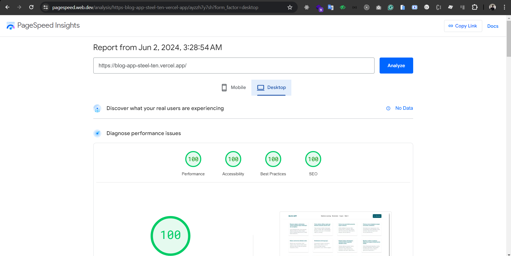

# Next.js Project

This is a [Next.js](https://nextjs.org/) project bootstrapped with [`create-next-app`](https://github.com/vercel/next.js/tree/canary/packages/create-next-app). The project utilizes several modern technologies and libraries to provide a robust and efficient development experience.

## Stack Technology

- **Next.js**: The React framework for production.
- **TypeScript**: A typed superset of JavaScript that compiles to plain JavaScript.
- **Recoil**: A state management library for React.
- **React Hook Form**: A library to help manage form state and validation in React.
- **Yup**: A JavaScript schema builder for value parsing and validation.
- **Material-UI**: React components for faster and easier web development.
- **Tailwind CSS**: A utility-first CSS framework for rapid UI development.

## Getting Started

First, clone the repository and install the dependencies:

```bash
git clone https://github.com/naufalyukafi/blog-app.git
cd blog-app
npm install
# or
yarn install

```
### Optimized App

for optimized App, please check this image. Thank you

